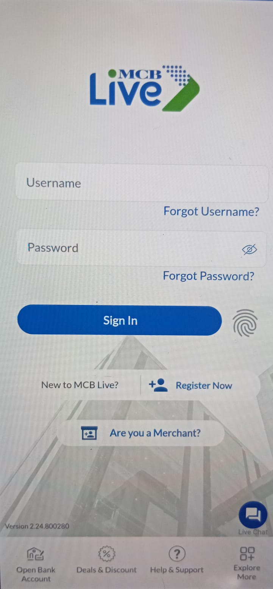

# MCB Login Page

A Flutter-based clone of the **MCB Live** banking app login screen. This project replicates the UI of MCB Bank Limited's mobile banking login page, including authentication fields, quick actions, and navigation options.

## 📱 Screenshot



## ✨ Features

- Clean and responsive login UI with background image
- Username and password input fields with validation styling
- Forgot Username & Forgot Password links
- Sign In button with fingerprint biometric option
- New user registration flow
- Merchant login option
- Bottom navigation with quick actions:
  - Open Bank Account
  - Deals & Discount
  - Help & Support
  - Explore More
- Live Chat support shortcut
- Version display (2.24.800280)

## 🛠 Tech Stack

- **Framework:** Flutter 3.8.1+
- **Language:** Dart
- **Icons:** Cupertino Icons, Material Icons
- **Tools:** Flutter Launcher Icons, Flutter Lints

## 📋 Prerequisites

- Flutter SDK (>=3.8.1)
- Dart SDK
- Android Studio / VS Code with Flutter extensions
- iOS Simulator / Android Emulator / Web browser

## 🚀 Getting Started

1. **Clone the repository**
   ```bash
   git clone https://github.com/<your-username>/mcb_login_page.git
   cd mcb_login_page
   ```

2. **Install dependencies**
   ```bash
   flutter pub get
   ```

3. **Run the app**
   ```bash
   flutter run
   ```

## 📁 Project Structure

```
lib/
├── main.dart                 # App entry point
└── pages/
    └── Login_Page.dart       # Main login screen UI

assets/
├── images/
│   ├── bg.png               # Background image
│   ├── mcb_logo.png         # MCB Bank logo
│   ├── merchant.png         # Merchant icon
│   └── chat.png             # Chat icon
└── icons/
    ├── live_chat.png        # Live chat icon
    ├── grid_add.png         # Explore more icon
    ├── discount.png         # Deals icon
    └── bank_edit.png        # Open account icon
```

## 📦 Dependencies

- `cupertino_icons`: ^1.0.8
- `flutter_launcher_icons`: ^0.14.4
- `flutter_lints`: ^6.0.0

## 📄 License

This project is for educational purposes only. MCB Bank and MCB Live are trademarks of MCB Bank Limited. This is a UI clone and is not affiliated with or endorsed by MCB Bank.

---

Built with ❤️ using Flutter.
